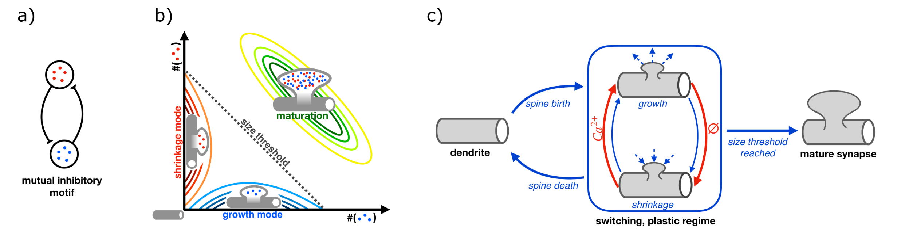

# Documentation on the code related to the paper *Autoregulation of switching behavior by cellular compartment size*

## Table of Contents
- [Project description](#introduction)
- [Directory structure](#directory-structure)

## Project description

**Contributors**

This project was conceived and led by Timothy O'Leary and Rodolphe Sepulchre, with code development by Monika Jozsa and Tihol Donchev. We also acknowledge the contributions of Andreas Petrides, Glenn Vinnicombe, and others for their valuable input during preliminary discussions and throughout the project's development.

**Summary**

This repository supports the study, "Autoregulation of switching behavior by cellular compartment size," which investigates how small cellular compartments, such as synaptic spines, can reliably regulate growth and shrinkage through biochemical switches. The paper introduces a new control mechanism demonstrating how the size of a system can navigate between switching and stable behaviour. We leverage that in many biochemical systems where deterministic analysis would predict stable behaviour, stochastic fluctuations can drive reliable biochemical switching. This however, is only true in small systems and as molecular copy numbers increase, stochasticity diminishes, effectively reducing to noise and stabilizing the system. Traditional mass-action kinetics fail to capture this size-dependent, stochastic switching behavior, highlighting the importance of this new approach.

Our proposed control mechanism is especially relevant for synaptic plasticity, where synapse size is thought to function as a key control parameter. 

*a) Schematic of a system with mutually inhibitory interactions between two species. 
b) Illustration of size-dependent behaviour of the mutually inhibitory system in a).
c) Diagram of our proposed control mechanism for auto-regulation of system size.*

We mdoel chemical reaction systems by birth-death processes with Mischaelis-Menten like kinetics for the inhibitory and excitatory propensities between species. We restrict our attention to simple two- and three-species reaction systems and explore how inhibition and in particular inhibitory loops contribute to switch-like behavior in small systems. We then demonstrate how autoregulation of system size can be achieved by assigning growth and shrinkage mechanisms to the distinct modes between which these small systems switch. This has potential applications in understanding more complex biochemical pathways and experimental results on synaptic potentiation and depression. Finally, we propose an analytical procedure for estimating uni and mutimodal parameter regimes and evaluate this proedure on two and three species systems. This approach is crucial for analysing higher dimensional systems and large parameter regimes where both simulations and experiments are infeasible.

This repository contains the scripts and data files used to generate the results presented in the _PNAS_ paper _Autoregulation of switching behavior by cellular compartment size_ and its supplementary materials. Below is an overview of the directory structure and a detailed list of scripts, along with their dependencies.

## Directory Structure

There are two main folders, `scripts/` and `plots/`. `scripts` contains all the scripts used to generate the data files. `plots` contains all the code and material that is needed to reconstruct the figures of the paper and its supplementary material organized into sub-folders by figure.

---

The content of `scripts/` and its short description is listed below.
  - **Gillespie_and_Distribution/**: Contains functions related to stochastic simulations for the time-evolution of the birth-death processes, distribution calculation from time-series data and sparsifying transformations on the distributions. 
  - **shared_functions/**: Contains utility functions used across different scripts.
  - **mode_search/**: Scripts for mode searching in sparse distributions.
  - **data_generation/**: Scripts for data generation, organized by dimensionality (2D, 3D) and system type (SII/SIE/SEE, symmetric/asymmetric).
  - **Examples/**: Contains examples demonstrating the use of some of the basic functions listed in the scripts.

Functions in `scripts/Gillespie_and_Distribution`

- **`GenConstants_EI`**: Generates rate constants in matrix form for E and I connections. Dependencies: None

- **`Gillespie_EI`**: Gillespie's stochastic simulation algorithm (SSA) with parallel computing for the different realisations. Return time-series for the evolution of the species. Dependencies: `Rates_EI`

- **`H1D_to_H`**: Converts state-space coordinates with probability greater than 0, from higher dimensional form to one dimensional form Dependencies: None

- **`H_to_H1D`**: Converts state-space coordinates with probability greater than 0, from one dimensional form to higher dimensional form. Dependencies: None

- **`Marginal_Sparse_to_grid`**: Converts a sparse distribution to a non-sparse grid distribution. If the sparse distribution was three dimensional, then it returns a marginal on the required dimensions. Dependencies: None

- **`Rates_EI`**: Calculates rates for each connection from constants. Dependencies: None

- **`Sparse_Distribution_EI`**: Calculates sparse distributions from time-series data. Dependencies: `H_to_H1D`, `H1D_to_H`

Content of `scripts/shared_functions`

- **`viridis, plasma, magma`**: Functions to generate basic color maps.
  - Dependencies: None

- **`distinguishable_colors`**: Generates colormap with distinguishable colors.
  - Dependencies: None

- **`W_list`**: Generates a list of possible connectivity structures for 2D or 3D systems.
  - Dependencies: None

- **`LogMat`**: Generates a matrix, where each row represents one possible combination of n elements from a set S, where n and S are inputs.
  - Dependencies: None

- **`error_ellipse`**: Plots error ellipses based on covariance matrices.
  - Dependencies: None

- **`Sparse_Distribution_weighted_mean`**: Calculates the weighted mean of a sparse distribution.
  - Dependencies: None

- **`automatic_LNA`**: Runs the analytical Linear Noise Approximation (LNA) on a system. Returns the equilibrium, the estimated covariance and the probability outside the axes based on a Gaussian approximation of the stationary distribution.
  - Dependencies: None

- **`arc_arrow`**: Draws a curved arrow between two points. 
  - Dependencies: None

- **`Sparse_Distribution_weighted_cov`**: Calculates the weighted covariance of a sparse distribution.
  - Dependencies: `Sparse_Distribution_weighted_mean`

- **`Plot_stationary_distrib`**: Plots 2D or 3D stationary distributions.
  - Dependencies: `Marginal_Sparse_to_grid`

- **`Woodford_Altman_github_repo`**: A toolbox for exporting figures from MATLAB to standard image and document formats.
  - Dependencies: None

Function in `scripts/mode_search`

- **`Closest_larger_point`**: Finds the closest larger local max among the selected local max. Dependencies: None

- **`DropingCloseLocMax`**: Refines a set of local maxima by removing those that are too close to each other, keeping only the most significant maxima. Dependencies: `Sparse_Distribution_weighted_cov`, `Closest_larger_point`

- **`LargestMode_complete_alg`**: Main function for the mode-search algorithm. The algorithm first finds peaks of potential modes. Then it allocates mode ID for all local max based on pointers to the peaks. Then it allocates mode ID to the remaining grid points based on the mode ID of a local max that is found with an up-hill algorithm. Dependencies: `Sparse_Distribution_Ext_local_max_1D`, `Sparse_Distribution_weighted_cov`, `Closest_larger_point`, `DropingCloseLocMax`, `Peak_Selection`, `loc_max_mode_id_from_kept`, `Sparse_Distribution_pointer_point_ID`, `Sparse_Density_Mode_Features`

- **`Local_Averaging`**: Performs a local averaging operation on a sparse distribution and identifies local maxima. Dependencies: `Sparse_Distribution_Ext_local_max_1D`

- **`ModeSelection`**: Identifies and selects significant local maxima from a sparse distribution. It applies filtering and merging processes to handle close maxima and then classifies all grid points based on these selected peaks. It involves finding local maxima, filtering out close peaks, sorting and selecting the most prominent ones, and assigning mode IDs to each grid point based on their proximity to these peaks. Dependencies: `Sparse_Distribution_Ext_local_max_1D`, `DropingCloseLocMax`, `Local_Averaging`, `H_to_H1D`, `Peak_Selection`, `Closest_larger_point`, `loc_max_mode_id_from_kept`, `Sparse_Distribution_pointer_point_ID`

- **`Peak_Selection_v4`**: Selects the most significant peaks from a set of local maxima based on a combination of their values, distances, and valley measures, with an option to limit the number of selected peaks. It calculates normalized distances and valley measures, evaluates peaks using a composite score, and sorts them to return the top peaks according to the specified criteria. Dependencies: `Sparse_Distribution_weighted_cov`, `RidgeMin`

- **`RidgeMin`**: Calculates the lowest point along a 'ridge' path between two points by moving from one point to the other along a strictly monotonic path that always approaches the other point, ensuring the path follows the ridge formed by local maxima. Dependencies: None

- **`Sparse_Density_Mode_Features`**:  Computes the centers, weights, and peak values of modes from a sparse density and the corresponding point mode IDs. It calculates the weighted mean for each mode, sums up the weights, and identifies the maximum peak value for each mode. Dependencies: `Sparse_Distribution_weighted_mean`

- **`Sparse_Distribution_Ext_local_max_1D`**: Identifies local maxima in a sparse distribution, computing their coordinates, values, and corresponding 1D encodings. It also determines neighboring points and their values, providing indices for the local maxima and their neighbors based on the input sparse matrices and 1D representations. Dependencies: `Sparse_Distribution_Ext_neighbours_1D`

- **`Sparse_Distribution_Ext_neighbours_1D`**: Calculates the 1D-coded coordinates, values, and indices of neighbors for each grid point in a sparse distribution. It determines neighboring points by adjusting the original 1D coordinates with small changes, and then maps these adjusted coordinates to the actual neighbors in the sparse dataset, retrieving their corresponding values and indices. Dependencies: `LogMat`

- **`Sparse_Distribution_pointer_point_ID`**: Assigns unique IDs to points in a sparse distribution by using a pointer algorithm that propagates labels from local maxima to neighboring points. It iteratively updates point IDs based on the maximum neighbor values and includes a fallback mechanism to label any remaining isolated points. Dependencies: None

- **`loc_max_mode_id_from_kept`**: assigns mode IDs to local maxima by first propagating IDs from already assigned maxima to their closest unassigned neighbors, and then filling any remaining unassigned maxima by copying the mode ID from their nearest assigned maxima. Dependencies: None

Functions in `scripts/data_generation`

The folder has two subfolders data_2D and data_3D.

#### scripts/data_generation/data_2D

##### Data_dwell_time

- **`DataGen_dwell_time.m`**: Generates dwell times based on systems parameters and saves them to data files.
  - Dependencies: `GenConstants_EI`, `Gillespie_EI`, `Sparse_Distribution_EI`
  - Generated Data Files: `Data_dwell_time_distr.mat`, `Data_dwell_time_X.mat`, `Data_dwell_time_T.mat`

##### Dynamic_Toggle_Switch

- **`DataGen_main.m`**: Generates data for dynamic toggle switch.
  - Dependencies: `GenData_Changing_param`

- **`GenData_Changing_param`**: Generates data for dynamic toggle switch with input with changing parameters and statistics on the generated data.
  - Dependencies: `GenConstants_EI`, `Gillespie_dyn_inp`, `Avg_Stats_from_data`, `ModeSwitch_ind`

- **`Gillespie_dyn_inp`**: Gillespie simulation with dynamic input.
  - Dependencies: `Reaction_funct`

###### Dynamic_Toggle_Switch/Helper functions

- **`Avg_Stats_from_data`**: Calculates average statistics from data.
  - Dependencies: None

- **`ModeSwitch_ind`**: Identifies mode switching indices.
  - Dependencies: None

- **`Reaction_funct`**: Handles reactions in a dynamic input simulation.
  - Dependencies: `Rates_EI`

- **`Stats_inp_activation`**: Calculates statistics for input activation.
  - Dependencies: None

##### SII_SIE_SEE_systems

- **`DataGen_2D.m`**: Generates 2D data for SII/SIE/SEE systems.
  - Dependencies: `GenConstants_EI`, `Gillespie_EI`, `Sparse_Distribution_EI`

- **`ModeSearch_on_data.m`**: Performs mode search on 2D data.
  - Dependencies: `LargestMode_complete_alg`

- **`LNA_2D_sym_and_asym.m`**: Generates LNA data for symmetric and asymmetric systems.
  - Dependencies: `automatic_LNA`

### scripts/data_generation/data_3D

#### Asymm_inhibitory/GillespieSimulation

- **`DataGen_inh_asymm_3D.jl`**: Generates 3D data for asymmetric inhibitory systems.
  - Dependencies: `Wlist_funct.jl`, `ssa` function from [Gillespie.jl](https://github.com/monikajozsa/Gillespie.jl)

#### Asymm_inhibitory/GillespieSimulation/LargestModeWeight

- **`ModeSearch_3D_asymm_inh.m`**: Searches for the largest mode in 3D asymmetric inhibitory data.
  - Dependencies: `LargestMode_complete_alg`, `H1D_to_H`
  - Generated Data Files: `A1_gill_asymm_inh.mat`, `A2_gill_asymm_inh.mat`, `A3_gill_asymm_inh.mat`, `A4_gill_asymm_inh.mat`, `A5_gill_asymm_inh.mat`, `A6_gill_asymm_inh.mat`, `A7_gill_asymm_inh.mat`

#### Asymm_inhibitory/LinearNoiseApproximation

- **`LNA_lambda_kIE.jl`**: Generates LNA data (covariance matrix, and its angle) for asymmetric inhibitory systems.
  - Dependencies: `Wlist_funct.jl`
  - Generated Data Files: `A1_lna_v4.mat`, `A2_lna_v4.mat`, `A3_lna_v4.mat`, `A4_lna_v4.mat`, `A5_lna_v4.mat`, `A6_lna_v4.mat`, `A7_lna_v4.mat`

- **`addPout.m`**: Adds Pout data to LNA results.
  - Dependencies: None
  - Generated Data Files: `A1_lna_v4.mat`, `A2_lna_v4.mat`, `A3_lna_v4.mat`, `A4_lna_v4.mat`, `A5_lna_v4.mat`, `A6_lna_v4.mat`, `A7_lna_v4.mat`

#### Symm_inh_exc/GillespieSimulation

- **`DataGen_3D_gill_omega.jl`**: Generates 3D Gillespie data for symmetric inhibitory/excitatory systems.
  - Dependencies: `Wlist_funct.jl`, `ssa` function from [Gillespie.jl](https://github.com/monikajozsa/Gillespie.jl)

#### Symm_inh_exc/GillespieSimulation/LargestModeWeight

- **`Omega_symm_inh_3D_mode_search.m`**: Searches for modes in 3D symmetric inhibitory/excitatory data.
  - Dependencies: `LargestMode_complete_alg`
  - Generated Data Files: `A1_gill_omega.mat`, `A2_gill_omega.mat`, `A3_gill_omega.mat`, `A4_gill_omega.mat`, `A5_gill_omega.mat`, `A6_gill_omega.mat`, `A7_gill_omega.mat`

#### Symm_inh_exc/LinearNoiseApproximation

- **`LNA_3D_inh_exc.m`**: Generates LNA data for 3D symmetric inhibitory/excitatory systems.
  - Dependencies: `automatic_LNA`

#### Symm_inhibitory/GillespieSimulation 

- **`DataGen_main.m`**: Generates main data for 3D symmetric inhibitory systems.
  - Dependencies: `GenConstants_EI`, `Gillespie_EI`, `Sparse_Distribution_EI`

- **`ModeSearch_from_A1_data.m`**: Searches for modes in data from systems with A1 architecture.
  - Dependencies: `LargestMode_complete_alg`
  - Generated Data Files: `Data_A1_k_001`, `Data_A1_k_0019`, `Data_A1_k_0028`, `Data_A1_k_0037`, `Data_A1_k_0046`, `Data_A1_k_0055`, `Data_A1_k_0064`, `Data_A1_k_0073`, `Data_A1_k_0082`, `Data_A1_k_0091`

- **`ModeSearch_from_A2_data.m`**: Searches for modes in data from systems with A2 architecture.
  - Dependencies: `LargestMode_complete_alg`
  - Generated Data Files: `Data_A2_k_001`, `Data_A2_k_0019`, `Data_A2_k_0028`, `Data_A2_k_0037`, `Data_A2_k_0046`, `Data_A2_k_0055`, `Data_A2_k_0064`, `Data_A2_k_0073`, `Data_A2_k_0082`, `Data_A2_k_0091`

- **`ModeSearch_from_A3_data.m`**: Searches for modes in data from systems with A3 architecture.
  - Dependencies: `LargestMode_complete_alg`
  - Generated Data Files: `Data_A3_k_001`, `Data_A3_k_0019`, `Data_A3_k_0028`, `Data_A3_k_0037`, `Data_A3_k_0046`, `Data_A3_k_0055`, `Data_A3_k_0064`, `Data_A3_k_0073`, `Data_A3_k_0082`, `Data_A3_k_0091`

- **`ModeSearch_from_A4_data.m`**: Searches for modes in data from systems with A4 architecture.
  - Dependencies: `LargestMode_complete_alg`
  - Generated Data Files: `Data_A4_k_001`, `Data_A4_k_0019`, `Data_A4_k_0028`, `Data_A4_k_0037`, `Data_A4_k_0046`, `Data_A4_k_0055`, `Data_A4_k_0064`, `Data_A4_k_0073`, `Data_A4_k_0082`, `Data_A4_k_0091`

- **`ModeSearch_from_A5_data.m`**: Searches for modes in data from systems with A5 architecture.
  - Dependencies: `LargestMode_complete_alg`
  - Generated Data Files: `Data_A5_k_001`, `Data_A5_k_0019`, `Data_A5_k_0028`, `Data_A5_k_0037`, `Data_A5_k_0046`, `Data_A5_k_0055`, `Data_A5_k_0064`, `Data_A5_k_0073`, `Data_A5_k_0082`, `Data_A5_k_0091`

- **`ModeSearch_from_A6_data.m`**: Searches for modes  in data from systems with A6 architecture.
  - Dependencies: `LargestMode_complete_alg`
  - Generated Data Files: `Data_A6_k_001`, `Data_A6_k_0019`, `Data_A6_k_0028`, `Data_A6_k_0037`, `Data_A6_k_0046`, `Data_A6_k_0055`, `Data_A6_k_0064`, `Data_A6_k_0073`, `Data_A6_k_0082`, `Data_A6_k_0091`

- **`ModeSearch_from_A7_data.m`**: Searches for modes in data from systems with A7 architecture.
  - Dependencies: `LargestMode_complete_alg`
  - Generated Data Files: `Data_A7_k_001`, `Data_A7_k_0019`, `Data_A7_k_0028`, `Data_A7_k_0037`, `Data_A7_k_0046`, `Data_A7_k_0055`, `Data_A7_k_0064`, `Data_A7_k_0073`, `Data_A7_k_0082`, `Data_A7_k_0091`

### scripts/data_generation/data_3D/Symm_inhibitory/LinearNoiseApproximation

- **`DataGen_LNA3D_symm_inh.m`**: Generates LNA data for 3D symmetric inhibitory systems.
  - Dependencies: `automatic_LNA`

Content of `scripts/Examples`

The `Examples` folder contains sample scripts demonstrating the usage of some of the key functions mentioned above.

- **`Example_2D.m`**: Example code for generating and plotting data for II, IE and EE networks of two species.

- **`Example_3D.m`**: Example code for generating and plotting data for a three species network.

---

The folder `plots/` contains sub-folders that are named after figures in the paper. The sub-folders include the relevant figure, and the data and the code that was used to generate the figure.
